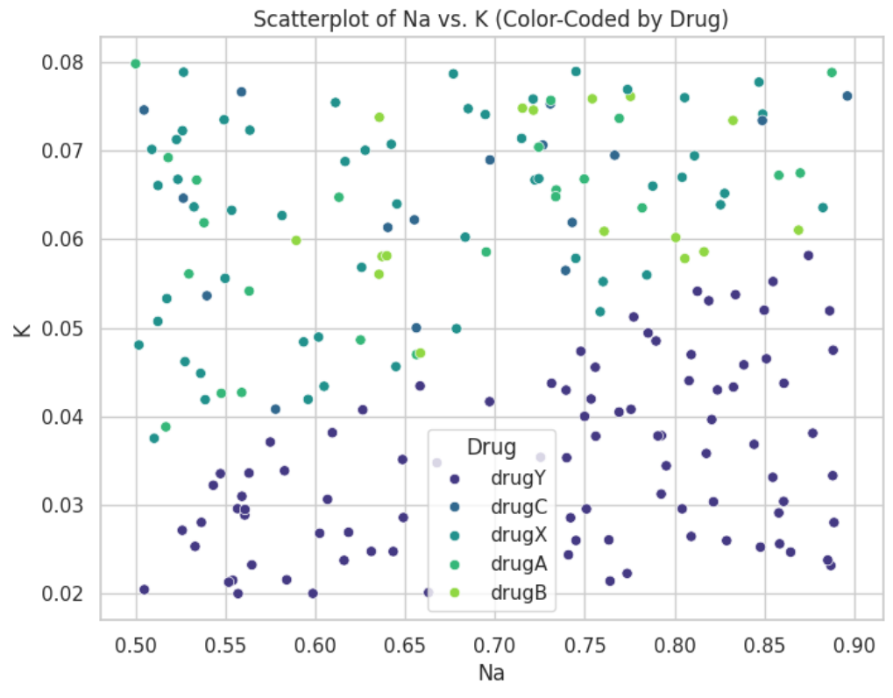
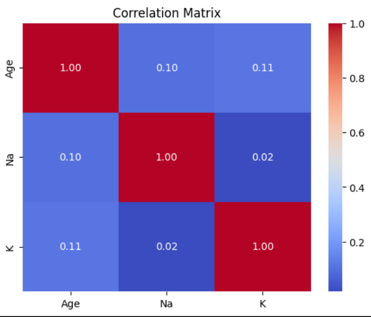
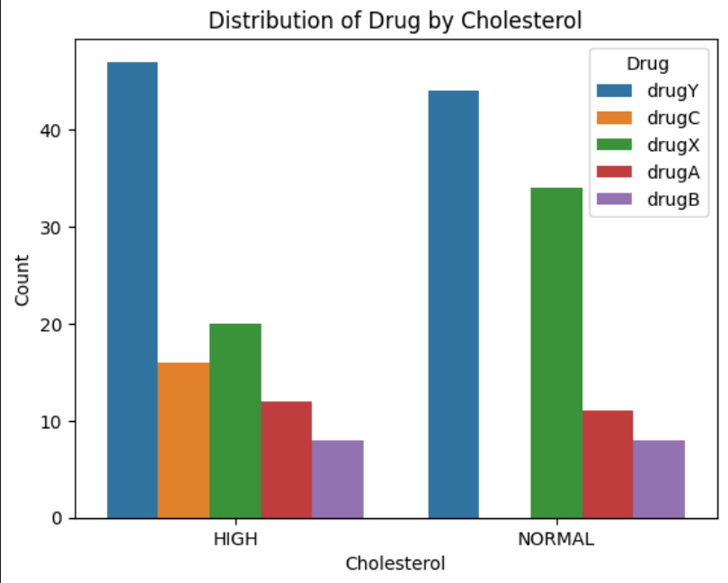
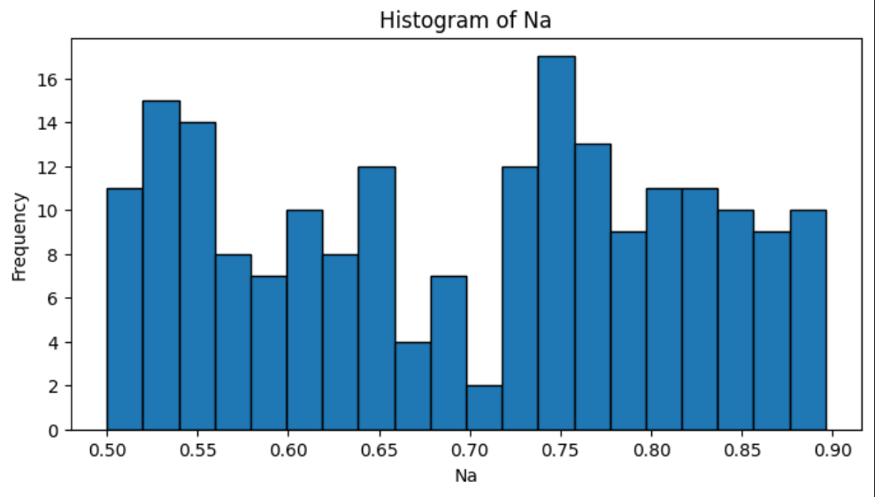

# 💊 Drugs-Classification

## 🚀 Project Overview

**Drugs-Classification** is an intelligent system for **drug classification** using machine learning algorithms.  
The goal is to predict the appropriate drug type based on patient medical data.

## 🛠️ Technologies & Tools

<p align="center">
  
  
  
  
  
  
</p>

## 📦 Installation & Running

1. Clone the repo:

   ```bash
   git clone https://github.com/amirhosssein0/Drugs-Classification.git
   cd Drugs-Classification

    Install dependencies:

pip install -r requirements.txt

Run the Jupyter notebook:

    jupyter notebook main.ipynb

🎯 How It Works

    Load and preprocess data

    Train multiple ML models (Logistic Regression, Random Forest, SVM, etc.)

    Evaluate models with accuracy, precision, recall, and F1-score

    Predict drug types for new patients

📸 Demo & Results







📫 Contact & Links

    GitHub Repository

    Email: amirhossssein0Gmail.com.com

